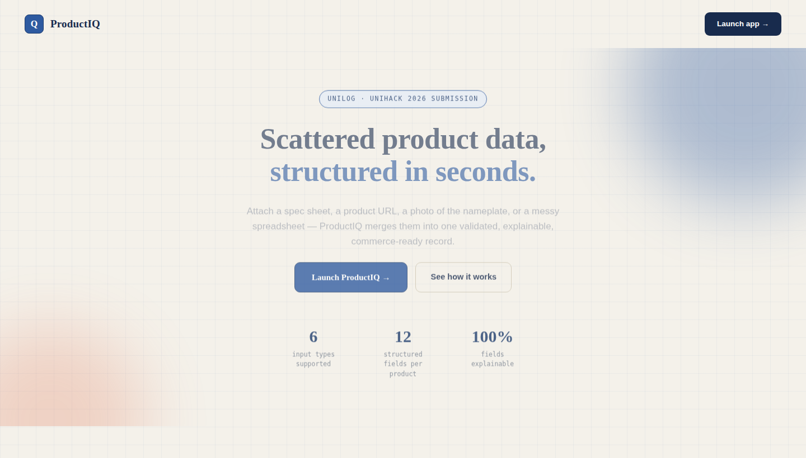
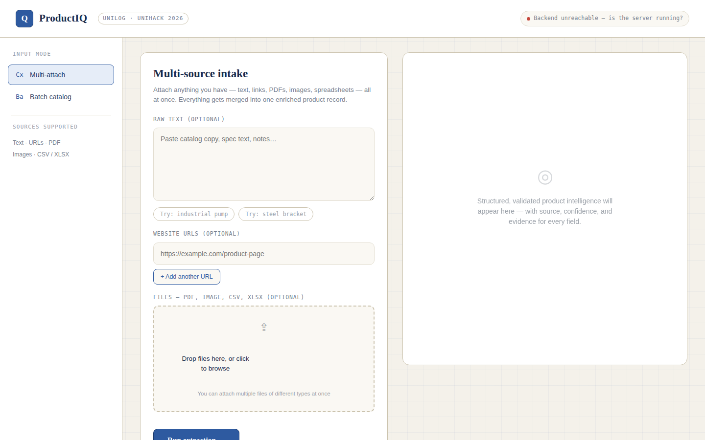
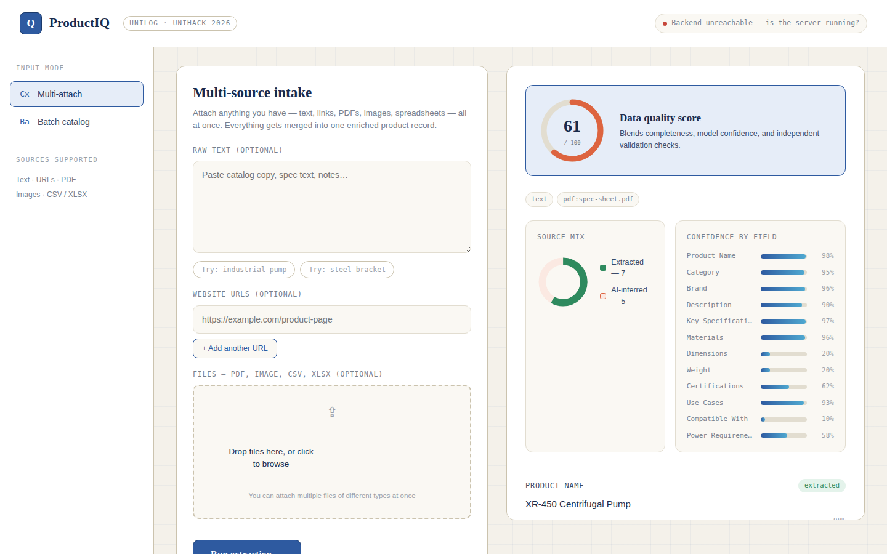
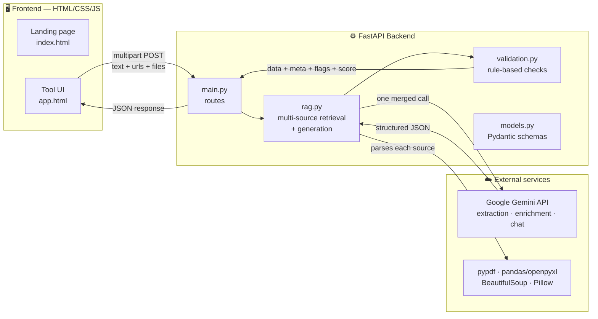
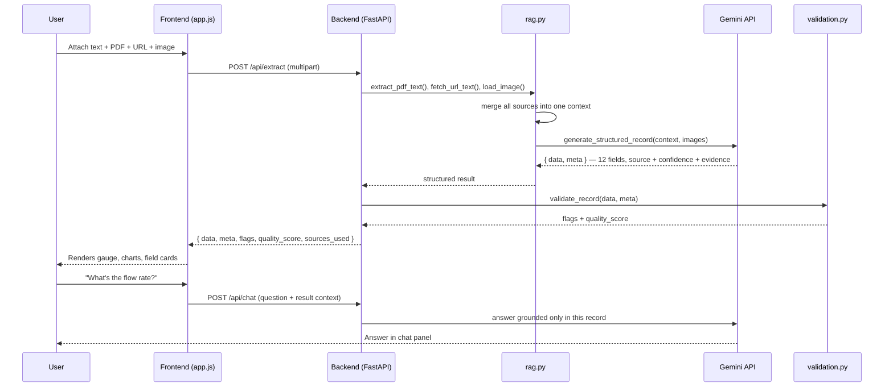

<div align="center">

# 📦 ProductIQ

### AI-Powered Product Intelligence for Industrial Commerce

**Turn scattered product data — a spec sheet, a URL, a nameplate photo, a messy spreadsheet — into a structured, validated, explainable commerce-ready record. In seconds.**

[](https://python.org)
[](https://fastapi.tiangolo.com)
[](https://ai.google.dev)
[](https://productiq-asks.onrender.com/api/health)
[](#license)

[Live Backend](https://productiq-asks.onrender.com/api/health) · [Report Bug](https://github.com/shivamdwivedicse/productiq/issues) · [Request Feature](https://github.com/shivamdwivedicse/productiq/issues)

</div>

<br>

> Built for **UniHack 2026** — Unilog's national AI innovation hackathon.
> Challenge: *"Industrial companies manage large amounts of product information across multiple sources — converting this scattered information into accurate, structured product data is challenging and time-consuming."*

<br>

## 🪤 The problem

A single industrial SKU's information is scattered across a website description, a PDF spec sheet, a scanned nameplate photo, and a half-filled spreadsheet row — in four different formats, with no consistency, and no single source of truth. Catalog teams spend **hours per product** manually copy-pasting this into a usable record. It doesn't scale, and it's easy to get wrong.

## 💡 The solution

**ProductIQ** takes *any combination* of those sources — attached all at once — merges them, and asks an LLM to build one structured, enriched product record. But it doesn't stop at "AI said so": every field is run through an **independent, rule-based validation layer** that checks units, verifies certifications against real industry standards, and flags inconsistencies — so what you get back is not just structured data, but data you can actually trust, with the receipts to prove it.

<br>

## ✨ What makes it different

| | |
|---|---|
| 🧩 **Multi-source, one merge** | Attach text, PDFs, URLs, images, and spreadsheets *together* — not as separate jobs. Everything merges into a single enriched record. |
| 🛡️ **Independent validation layer** | Doesn't just trust the model's own confidence. A separate rule-based checker verifies units (mm/kg/V), matches certifications against known standards (ISO, CE, RoHS...), and flags category/description mismatches. |
| 🔍 **Every field, explained** | `extracted` vs `AI-inferred`, a confidence %, and the exact evidence snippet — for every single field, every time. |
| 📊 **Visual trust dashboard** | A live Data Quality Score gauge, a source-mix donut chart, and a confidence-by-field bar chart. |
| 💬 **Ask about your result** | A grounded chat assistant answers questions about the specific extracted record — no digging through raw JSON. |
| 📦 **Batch-ready** | Process a whole catalog of product lines in one pass, with a quality score per item. |
| 🔐 **API key never touches the browser** | Lives only in the backend `.env` — the frontend never sees it. |

<br>

## 🎬 See it in action

<div align="center">


*Landing page*

<br><br>



*Attach text, URLs, PDFs, images, and spreadsheets together*

<br><br>



*Structured output — quality score, source-mix, confidence per field, and validation flags*

</div>

<br>

## 🏗️ Architecture



### Request flow



<br>

## 🧠 How validation actually works

Most extraction tools stop at "the model said 98% confident." ProductIQ doesn't trust that number alone — it runs a **second, independent pass**:

1. **Unit sanity checks** — does `dimensions` / `weight` / `power_requirements` actually contain a real-world unit pattern (`mm`, `kg`, `V`, `Hz`...)? If not → flagged.
2. **Certification verification** — is each claimed certification (`ISO 9001`, `CE`, `RoHS`...) a recognized industry standard, or did the model invent one? If unrecognized → flagged.
3. **Cross-field consistency** — does the `category` actually relate to the `description`? Mismatches are flagged.
4. **Composite Data Quality Score** — blends field completeness, average model confidence, and validation penalties into one 0–100 score.

This runs **entirely server-side**, in plain Python — no additional LLM call, so it's fast and deterministic.

<br>

## 🛠️ Tech stack

<div align="center">

| Layer | Technology |
|---|---|
| **Backend** | Python · FastAPI · Pydantic · Uvicorn |
| **AI / Generation** | Google Gemini API (`gemini-3.6-flash`) — text + vision |
| **Source parsing** | `pypdf` (PDF) · `pandas`/`openpyxl` (spreadsheets) · `BeautifulSoup`+`requests` (web) · `Pillow` (images) |
| **Frontend** | HTML5 · CSS3 · Vanilla JavaScript — zero build step |
| **Deployment** | Render (backend) · Render (frontend) |
| **Secrets** | `python-dotenv` — key lives only in backend `.env` |

</div>

<br>

## 📂 Project structure

```
productiq/
├── backend/
│   ├── main.py            # FastAPI app + routes (/api/extract, /api/extract-batch, /api/chat)
│   ├── rag.py              # multi-source ingestion (PDF/URL/image/sheet) + Gemini calls
│   ├── models.py           # Pydantic request/response schemas
│   ├── validation.py       # independent rule-based validation + quality score
│   ├── requirements.txt
│   └── .env.example        # copy to .env and add your GEMINI_API_KEY
│
└── frontend/
    ├── index.html          # landing page
    ├── app.html            # the actual tool (multi-attach, batch, results, chat)
    ├── landing.js           # scroll-reveal + hero animations
    ├── style.css            # shared styles
    └── app.js               # extraction logic, charts, chat wiring
```

<br>

## 🚀 Getting started

### 1 · Clone the repo
```bash
git clone https://github.com/shivamdwivedicse/productiq.git
cd productiq
```

### 2 · Backend setup
```bash
cd backend
pip install -r requirements.txt
cp .env.example .env
```
Add your free Gemini API key to `.env` (get one at [aistudio.google.com/apikey](https://aistudio.google.com/apikey)):
```env
GEMINI_API_KEY=AIzaSy_your_key_here
```
Run it:
```bash
uvicorn main:app --reload --port 8000
```
Verify: open [http://127.0.0.1:8000/api/health](http://127.0.0.1:8000/api/health) → should show `{"status":"ok","key_configured":true}`

### 3 · Frontend setup
Just open `frontend/index.html` in a browser — no build step needed. Or serve it statically:
```bash
cd frontend
python3 -m http.server 5500
```
Visit `http://127.0.0.1:5500`

> If your backend runs somewhere other than `localhost:8000`, set `window.PRODUCTIQ_API_BASE` in `app.html` before `app.js` loads.

<br>

## 📡 API reference

| Endpoint | Method | Description |
|---|---|---|
| `/api/health` | `GET` | Health check + whether `GEMINI_API_KEY` is configured |
| `/api/extract` | `POST` | Multi-source extraction — accepts `text`, `urls` (newline-separated), and `files[]` (PDF/image/CSV/XLSX) as multipart form data |
| `/api/extract-batch` | `POST` | Batch mode — accepts `lines` (newline-separated product descriptions) |
| `/api/chat` | `POST` | Ask a question grounded in a specific extracted record |

Interactive API docs are auto-generated by FastAPI at `/docs` once the backend is running.

<br>

## 🗺️ Roadmap

- [ ] Human-in-the-loop correction — feed manual edits back into future extractions
- [ ] One-click export to Shopify/Amazon-ready CSV formats
- [ ] Multi-language source support
- [ ] Direct ERP/PIM system connectors
- [ ] Persistent catalog storage with versioning

<br>

## 🤝 Contributing

Contributions, issues, and feature requests are welcome — feel free to check the [issues page](https://github.com/shivamdwivedicse/productiq/issues).

1. Fork the repo
2. Create your feature branch (`git checkout -b feature/amazing-thing`)
3. Commit your changes (`git commit -m 'Add amazing thing'`)
4. Push to the branch (`git push origin feature/amazing-thing`)
5. Open a Pull Request

<br>

## 📄 License

Distributed under the MIT License. See `LICENSE` for details.

<br>

## 👤 Author

<div align="center">

**Shivam Dwivedi**

[](mailto:shivamdwivedicse20919@gmail.com)
[](https://www.linkedin.com/in/shivam-dwivedi-27661a395)
[](https://github.com/shivamdwivedicse)

</div>

<br>

<div align="center">

**If this project helped or interested you, consider giving it a ⭐ — it genuinely helps.**

*Built with ☕ and a hackathon deadline for UniHack 2026*

</div>
